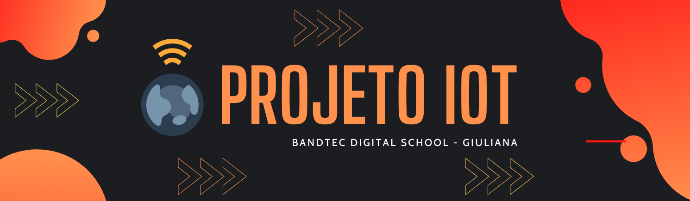
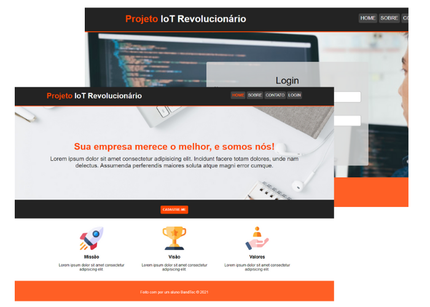

# Projeto IoT Revolucionário 
 


### **Projeto IoT** é um de software de Internet das Coisas desenvolvido para facilitar o aprendizado em contextos acadêmicos. Esse projeto visa ajudar os alunos da Faculdade [@Bandtec](https://github.com/BandTec) em projetos na disciplina de Pesquisa e Inovação.
#
### **Tópicos abordados:**
- HTML
- CSS
- Java Script
- Charts

### **Layout:**

# 

## Instalação
**Clone ou faça download do projeto, abra o diretório raiz no VS Code, e no terminal execute**:
```
npm install
```

**Após terminar, execute:**
```
npm start
```
#


## Desenvolvedores
- @miniguiti
